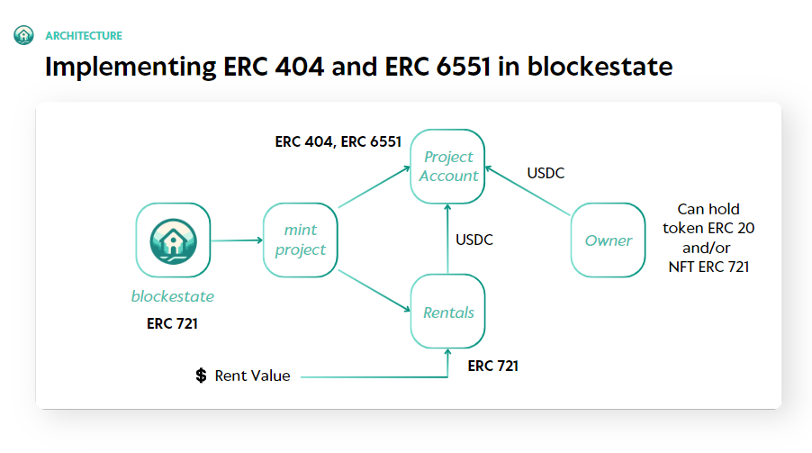
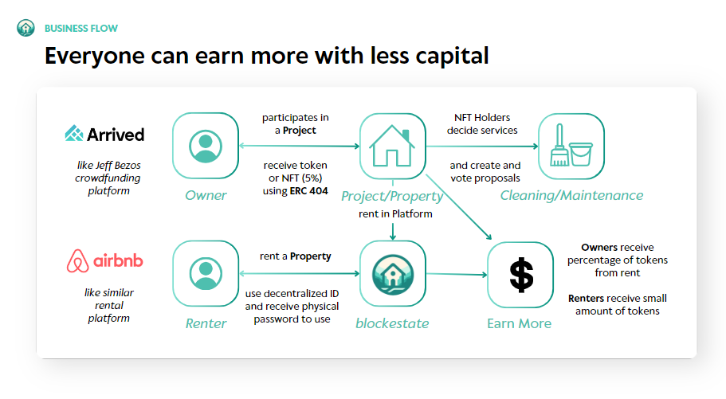

# blockestate - ETH Denver 2024

## Frontend Repo

## Basic Information
- *Project Name:* blockestate
- *Project Team Members:* Luiz, Bryan and Daniel
- *Project Establishment Date:* 2024, March

_

## Overall Project Introduction
- *Project Background:*

   > "We love the tokenization topic and we saw in the ERC 404 a unique way to unity the token properties and nft properties, such as receive earnings (like rent value) and own roles (like property manager) and then we came with the idea to use ERC 6551 to ensure safety in the transactions. In this way, we bring a very stable and good market, real estate, to implement a new decentralized platform for real estate"

- *Project Introduction:*

  - blockestate is a decentralized end-to-end platform for real estate, from funding to rent, using ERC 404 and ERC 6551 to allow liquidity, safety and tokenization in the process.

- *Project Explanation:*

### Problem

The economic scenario in developing countries is an issue for real estate, high interest rates (over mortgages) and high deposit upfront (downpayment) to finance a property. In Brazil, for example, the interest rate is over 10% and the deposit upfront is at least 20% of the property value. So, it’s not easy to have money to buy a property to live in or even to rent for someone else. 

### Solution

Blockestate can offer to future owners a possibility to get part of a crowdfunding for a property and be a platform for renters to find good values in the market for short rental travels.

Using blockchain, it is possible to tokenize a property, making a crowdfunding to buy a property and to give people a share of a future rent money for example. Moreover, the use of less capital can permit owners to have less risk and then make the rent value more competitive to the market. The scenario of high interest rates in developing countries can permit leveraging the high interest rate scenario for owners of other parts of the world. In this way, everyone can earn money until they get their own house.

### Technology

The use of ERC 404 can support the solution in this way:

- Everyone in the crowdfunding is a token holder and receive rent money accordingly with the share of the property value tokenized;
- If someone has 5% of the property value, then the owner can mint a NFT;
- The NFT holders can create proposals (to manage, increase rent, sell the property for example) and define aspects such as cleaning and maintenance services;
- NFT holders can have a discount in the rent based on the amount of share they have (if I have 10% of the property, so 10% of discount)
- The platform has mechanisms such as poison pill to guarantee it will be everything alright with the relationship between NFT holders.

 This facilitates the operational flow and then the use of ERC 6551 provides a safe way to rent the property to a specific user. 

- *Project Repos:*

[Smart Contracts Repo](https://github.com/WhaleLabs/block-estate-contracts)

[Frontend Repo](https://github.com/WhaleLabs/block-estate-frontend)

[Backend Repo](https://github.com/WhaleLabs/block-estate-backend)

- *Project Demo and Presentation:*

[Demo Link]((https://block-estate-24.netlify.app/))

[Demo Video](https://youtu.be/)

[Presentation Link](https://www.canva.com/design/DAF-UOG3CTI/xsD5543tz1ZZ0fL8KqCybA/edit?utm_content=DAF-UOG3CTI&utm_campaign=designshare&utm_medium=link2&utm_source=sharebutton)

- *Technical Architecture:*

- *Business Flow:*

- *Project Logo:* 

_

## Items Completed For the Hackathon

  - *Blockchain Side:*
      - [ProjectAccount](https://github.com/WhaleLabs/block-estate-contracts/blob/master/src/ProjectAccount.sol): It's the contract that creates the account for the deposits, managing the transactions between stakeholders and where it is implemented the ERC 404 and the ERC 6551.
      - [Rentals](https://github.com/WhaleLabs/block-estate-contracts/blob/master/src/Rentals.sol): It's the address that keeps the implementation of the rent value interaction.
      - [WhaleFinance](https://github.com/WhaleLabs/block-estate-contracts/blob/master/src/BlockEstate.sol): It's the main contract, which implements the creation of the project (property) starting the crowdfunding.

  - *Client Side:*
    - *Web Owner Features:*
      - Focused in the funding and management of properties.
      - Create Project ('/create-project' route)
      - Funding Project (after choose one in the '/projects' route)
      - Manage holdings and create proposals ('/my-holding' route)
    - *Web Renter Features:*
      - Focused in the rent of properties.
      - Rent a Property (after choose one in the '/' route)
      - See Trips upcoming or past ('/trips' route)
     
   For better understanding of the routes and features: [Frontend App](frontend/src/App.tsx)

### Addresses

- XDC:
   - BlockEstate deployed at:  0x69801C169647Ad125707Dd40096D4EDC20Bb521a
   - Payment Token deployed at:  0x536527976E98E253B424a3655E695D144E343341
   - ERC6551Registry deployed at:  0x76D11E63a7b2Ec1C7A4D4Fc88f1D74FC8b98d651
   - Rentals implementation deployed at:  0x34Da10E3a5d15e27896445b58b932E2F5D98e426
   - Beacon deployed at:  0xc77e76e8400A9436A7ce4ebCFA18dF76Ae60ED01
   - ProjectAccount implementation deployed at:  0xAF4Bd9d6E474afa59655EFe171e02e4670718f09

- Linea:
   - BlockEstate deployed at:  0xBd6ed8BAF6904a97c3125f1b6920f268fF39Aaa2
   - Payment Token deployed at:  0xb0744daaf6E84855C3551CDfbCec5892A8892B86
   - ERC6551Registry deployed at:  0x9C080703256BDF9Ea1b485aE72f13E31f74C558b
   - Rentals implementation deployed at:  0x0944830916CECb637613c9Fd0e8F6C21ccFFB4eF
   - Beacon deployed at:  0x0fee4c356DEeF6567E95b6394420583CA1D1fEEa
   - ProjectAccount implementation deployed at:  0x0120aD0f0a676877fA36295c763eCB092a5a1E37
 
- BASE Sepolia Testnet:
   - BlockEstate deployed at:  0xBd6ed8BAF6904a97c3125f1b6920f268fF39Aaa2
   - Payment Token deployed at:  0xb0744daaf6E84855C3551CDfbCec5892A8892B86
   - ERC6551Registry deployed at:  0x9C080703256BDF9Ea1b485aE72f13E31f74C558b
   - Rentals implementation deployed at:  0x0944830916CECb637613c9Fd0e8F6C21ccFFB4eF
   - Beacon deployed at:  0x0fee4c356DEeF6567E95b6394420583CA1D1fEEa
   - ProjectAccount implementation deployed at:  0x0120aD0f0a676877fA36295c763eCB092a5a1E37
_

## Team Member Information
*Bryan Borck*

 - Frontend developer and designer
 - Computer Engineering student at ITA (Brazil), PBA student cohort HK 2024, 2 years experience in Equity Research and involved (as participant and winner) in many web3 hackathons
 - [Github](https://github.com/BryanBorck)
 - Email: bryanborck@gmail.com

*Luiz Vasconcelos*

 - Blockchain developer
 - Computer Engineering student at ITA (Brazil), PBA student cohort HK 2024, 1 year experience in blockchain development in a leadership area of innovation (brazilian startup), 2 years experience in Equity Research and involved (as participant and winner) in many web3 hackathons
 - [Github](https://github.com/luiz-lvj)

*Daniel Yuki*
 - Fullstack developer
 - Engineering student at ITA (Brazil), self-taught developer, director at university blockchain club and competed (and won) in several web2 and web3 hackathons
 - [Github](https://github.com/DanielYuki)

